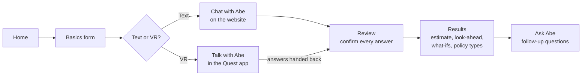
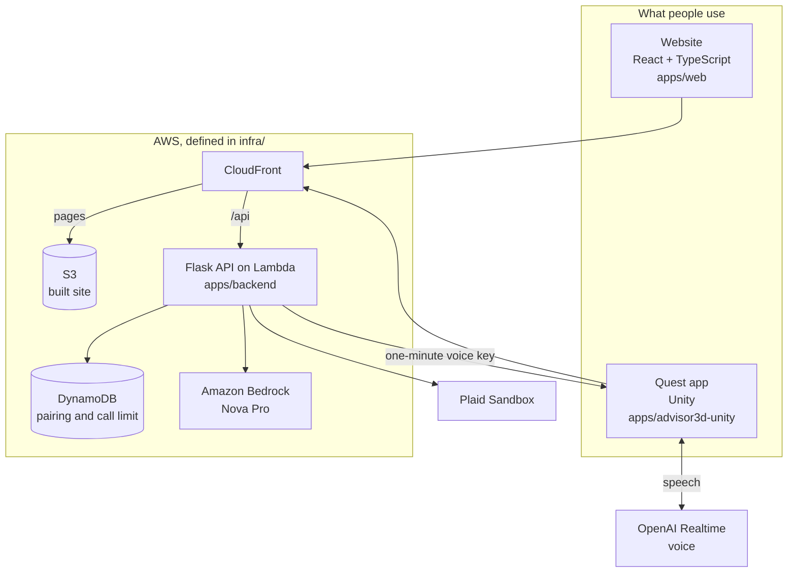
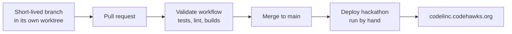

# LincLife

LincLife helps someone work out how much life insurance their family might need. You have a
short conversation with Abe, a pixel-art guide, on the website or in a Meta Quest headset.
You check every answer, then see an estimate with the math behind it.

- **Watch it working:** https://youtu.be/rsjHEd0Yo1Y
- **Try it:** https://codelinc.codehawks.org

It gives an educational estimate. It does not quote premiums or approve anyone for a policy.

## How it works



1. **Basics.** Six quick questions on a form, starting with your age (18 or older).
   Connecting accounts through Plaid Sandbox can fill in your debts and suggest savings.
   Income, family and insurance are always asked.
2. **Chat.** Abe asks one question at a time. You answer in your own words ("about 85k give
   or take") or tap a suggestion.
3. **Review.** Every answer is shown back to you. Nothing is calculated until you confirm.
4. **Results.** A short slide deck: what your family would need, what you already have, the
   gap, a ten-year look-ahead, what-if scenarios, and term compared with permanent coverage.
   Under it is the full math, shown two ways: how the additional coverage is worked out, and
   what would be left for ongoing support after one-time costs are set aside.
5. **Ask Abe.** Follow-up questions about your own results.

Choosing VR shows a QR code. The Quest app scans it, runs the same conversation out loud,
and hands the answers back to the website for Review and Results.

## Architecture



The API has a small set of jobs:

| Endpoint | What it does |
| --- | --- |
| `POST /api/intake` | Reads a typed or spoken answer into a field |
| `POST /api/recommendations` | Picks term and permanent policies from a fixed shortlist |
| `POST /api/chat` | Answers follow-up questions about the results |
| `/api/pair` | Pairs a browser with a headset and passes answers between them |
| `/api/plaid` | Reads Plaid Sandbox balances to fill in debts and suggest savings |
| `POST /api/voice/session` | Gives the Quest app a short-lived key for voice |

## The rules we build by

The full version is in the [design principles](docs/design-principles.md). In short:

- **The calculator owns every number.** The model reads answers and explains. Plain code does
  the math, and the server removes any model sentence with an amount that did not come from
  the user or the calculator.
- **A failure never costs you your answers.** Every call has a time limit, a plain message,
  and a labeled fallback. If the AI is unreachable, Abe's built-in script takes over.
- **The math is tested.** It lives in three places (website, server, Quest app) and the same
  example households run through all three test suites.
- **We keep as little as possible.** Answers stay in the browser tab. Headset pairing data
  expires after two hours.

## Repository layout

```text
apps/
  web/               React and TypeScript website
  backend/           Flask API: intake, recommendations, chat, pairing, Plaid, voice
  advisor3d-unity/   Native Unity app for Meta Quest
  advisor3d-web/     Earlier WebXR prototype, served at /advisor3d/index.html
infra/               CloudFormation templates and namespace configuration
scripts/             Build, validation, publishing and migration tools (tests in scripts/tests/)
docs/                Design principles and operational guides (older plans in docs/planning/)
.github/workflows/   Validation and manual deployment workflows
```

| Path | Guide |
| --- | --- |
| `apps/web/` | [Website](apps/web/README.md) |
| `apps/backend/` | [Backend](apps/backend/README.md) |
| `apps/advisor3d-unity/` | [Quest app](apps/advisor3d-unity/README.md) |
| `apps/advisor3d-web/` | [WebXR prototype](docs/advisor3d.md) |
| `infra/`, deployment | [AWS guide](docs/agent-aws.md) |
| Working in this repo | [AGENTS.md](AGENTS.md) |

Each application owns its dependencies and tests. Browser applications retain
independent npm lockfiles. Unity retains its standard `Assets/`, `Packages/`, and
`ProjectSettings/` directories. No generated deployment assets are committed, and
`build/` is ignored output: the combined website in `build/site/` and the Lambda ZIP
in `build/backend.zip`.

## How we work



Merging to `main` does not deploy. Deployment is a manual GitHub Actions workflow.
[AGENTS.md](AGENTS.md) covers how the team coordinates.

## Local development

Use Python 3.12+ and Node 24, matching the CI Node version. Shell build scripts
require Bash (Git Bash works on Windows). Unity development requires Unity
6000.3.25f1 with Android Build Support; its standalone logic tests use .NET 9+.

Install Python development dependencies from the repository root:

```sh
python -m pip install -r requirements-dev.txt
```

Start the API from `apps/`, which exposes the existing `backend` Python package:

```sh
cd apps
python -m flask --app backend.app run --port 8000
```

In a separate terminal, start the website from the repository root:

```sh
cd apps/web
npm ci
npm run dev
```

The website proxies `/api` to localhost port 8000. Without model credentials, the
API returns an unavailable response and the website uses its scripted fallback.
The backend reads environment variables, not `.env` files; [`.env.example`](.env.example)
lists their names and how to load them. See the
[backend guide](apps/backend/README.md) for configuration and HTTP contracts.
Consult Israel before making live model calls in the shared AWS account.

To run the built website and the API together without a network, install and build once,
then start both. Only the first command downloads anything; neither writes outside the repository:

```sh
bash scripts/build-local.sh   # venv, pinned Python packages, npm ci, website build
bash scripts/run-local.sh     # API on port 8000, website on http://localhost:4173
```

For WebXR, run `npm ci` and `npm run dev` in `apps/advisor3d-web/`.
For native Quest builds and headset setup, follow the
[Unity guide](apps/advisor3d-unity/README.md).

## Validation and builds

From the repository root, run these commands in Bash:

```sh
(cd apps && python -m unittest discover -s backend/tests -v)
python -m unittest discover -s scripts/tests -v
cfn-lint infra/bootstrap.json infra/app.json
python scripts/validate_repo.py
python scripts/check_branding.py
bash scripts/build-app.sh
(cd apps/web && npm test && npm run lint)
(cd apps/advisor3d-web && npm test)
node --test scripts/tests/legacy_redirect.test.cjs
python scripts/build_backend.py
dotnet run --project apps/advisor3d-unity/Tests~
```

Python tests stub providers and run without paid inference. The builds install
locked npm dependencies and pinned Linux-compatible Python wheels. The combined
site build puts the website at `build/site/` and WebXR at
`build/site/advisor3d/`. Read the [Advisor3D guide](docs/advisor3d.md) before
changing build cleanup: publishing synchronizes the complete output with deletion.
Standalone .NET tests do not replace Unity editor or headset checks.

## Deployment and account boundaries

**Deployment remains on hold until Israel confirms configuration and explicitly
gives the go-ahead.** Existing AWS resources also require the staged
[namespace migration](docs/rename-migration.md) before renamed workflows run.
The backend uses approved Nova Pro and a shared limit of 30 Bedrock calls per
rolling 60 seconds. Deployment smoke checks include three billable model calls.

Read [AGENTS.md](AGENTS.md) and the [AWS guide](docs/agent-aws.md) before changing
infrastructure or deployment workflows. AWS changes run through reviewed
CloudFormation and manual GitHub Actions on `main`, using short-lived OIDC
credentials. Local AWS CLI use is read-only. Never commit credentials.

The repository owns the `codelinc-hackathon` namespace and only the exact legacy
resources documented for migration. Codehawks production infrastructure shares
the account and must remain untouched. The AWS guide covers bootstrap, deployment,
DNS, and teardown, including the required account-specific deletion confirmation.
